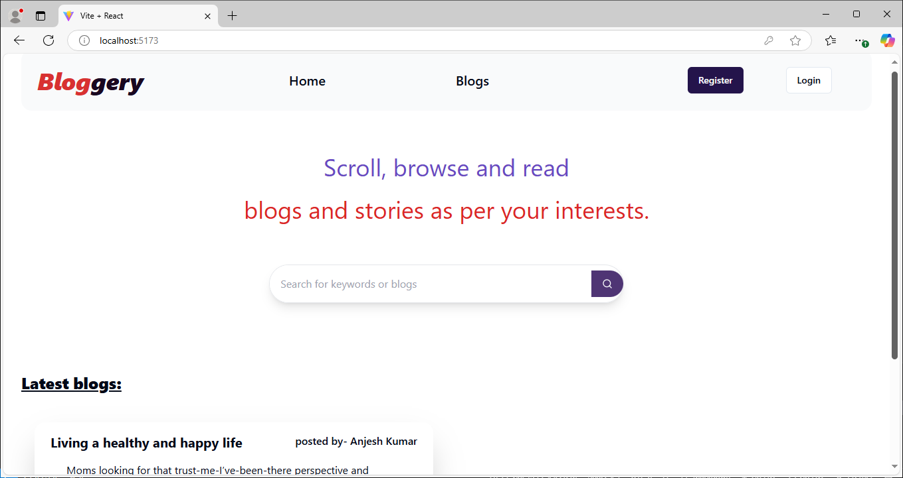
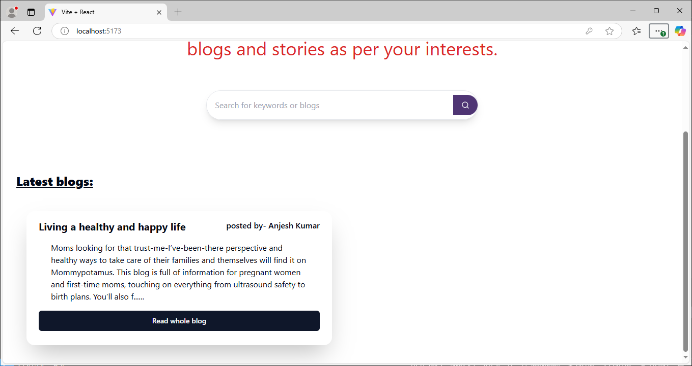
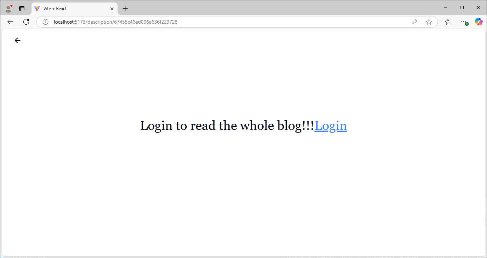
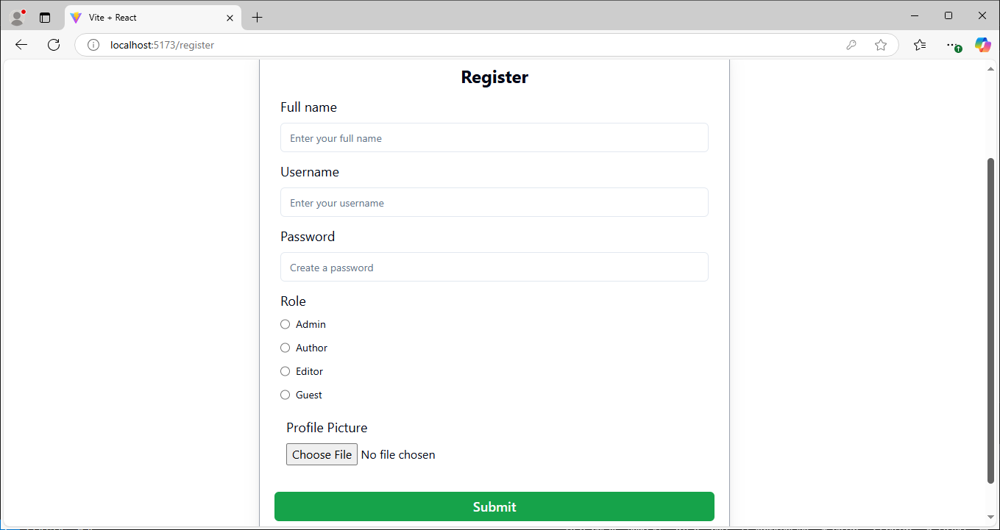
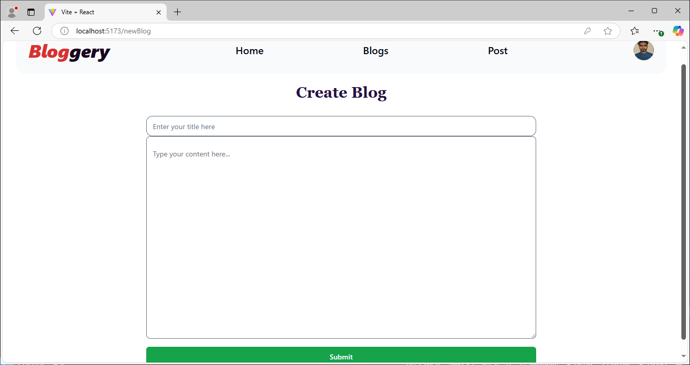
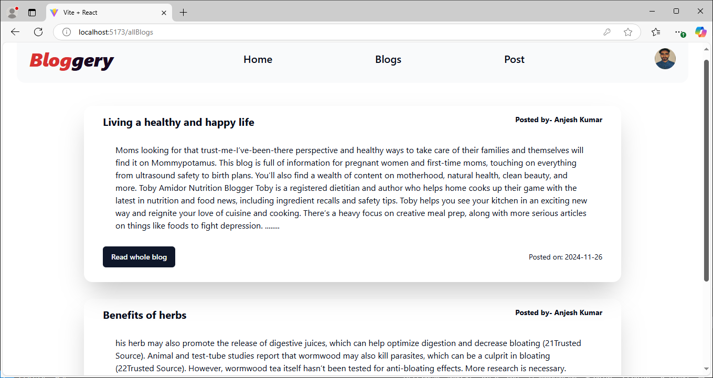
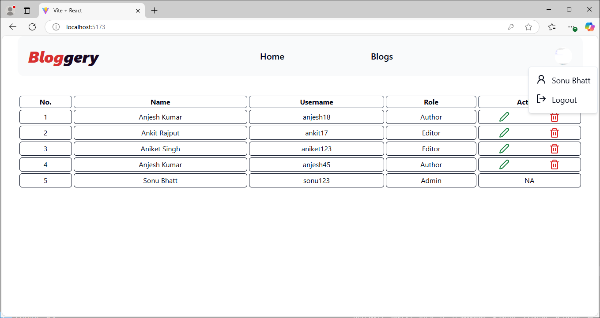

# Blog App using MERN Stack

 Welcome to the blog app repository! This application is built using the MERN (MongoDB, Express, React, Node.js) stack and comes with various functionalitites like posting, editing and deleting blogs.

## Features
 The core feature of this app revolves around its feature to provide access to users based on their roles.

 There are 4 types of roles available in the app namely "Author", "Admin", "Editor" and "Guest".
 There are different set of components and pages for admin as he is allowed to manage all the users of the app.

 The blogs can only be deleted by the authors who posted them.

 Editors can edit any blog as per their needs, wishes or requirements.

 The admin can perform operations like delete users and edit their details as well.

## Screenshots

### This is the home page when there is no user logged in.

### User shall not be able to read the complete blog if he is not signed in.

### The login page.

### The register page.

### Navbar and home page for the users with author role.

### Create blog page for the authors.

### The 'Blogs' page.

### The admin home page.

### Te blog description page.